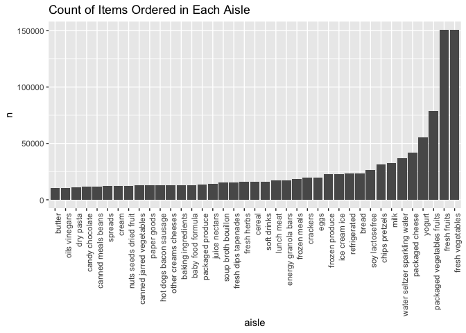
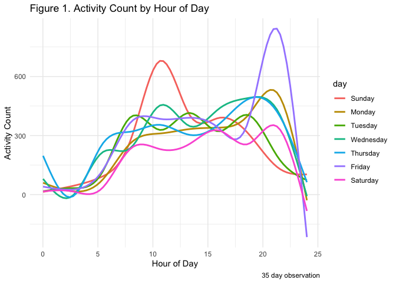
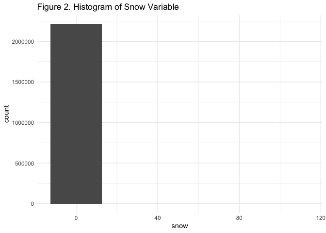
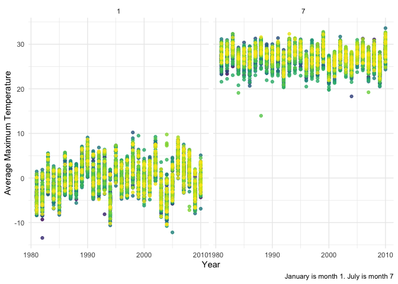

Homework 3
================
Aaron Mittel
2022-10-15

# Problem 1

-   The instacart dataset includes **1384617 rows** and **15 columns**.
-   There are **131209 distinct users** who have ordered a total of
    **1384617 orders** among **39123 distinct products**.
-   Key variables include: order_id, product_id, user_id, order_number,
    order_hour_of_day, days_since_prior_orer, aisle_id, and
    department_id.
-   There are **134 aisles**.
-   In Table 1 below we can see that the most items are ordered from
    Aisle 83, with a total of 150,609 items ordered.

| aisle_id |      n |
|---------:|-------:|
|       83 | 150609 |
|       24 | 150473 |
|      123 |  78493 |
|      120 |  55240 |

**Table 1**

-   Plot indicating number of items in each aisle:
    <!-- -->

-   Table 2, below, shows the three most popular items in each of the
    aisles “baking ingredients”, “dog food care”, and “packaged
    vegetables fruits”, including the number of times each item is
    ordered.

| aisle                      | product_name                                  |    n | rank |
|:---------------------------|:----------------------------------------------|-----:|-----:|
| packaged vegetables fruits | Organic Baby Spinach                          | 9784 |    1 |
| packaged vegetables fruits | Organic Raspberries                           | 5546 |    2 |
| packaged vegetables fruits | Organic Blueberries                           | 4966 |    3 |
| baking ingredients         | Light Brown Sugar                             |  499 |    1 |
| baking ingredients         | Pure Baking Soda                              |  387 |    2 |
| baking ingredients         | Cane Sugar                                    |  336 |    3 |
| dog food care              | Snack Sticks Chicken & Rice Recipe Dog Treats |   30 |    1 |
| dog food care              | Organix Chicken & Brown Rice Recipe           |   28 |    2 |
| dog food care              | Small Dog Biscuits                            |   26 |    3 |

**Table 2**

-   Table 3, below, shows the mean hour of the day at which Pink Lady
    Apples and Coffee Ice Cream are ordered on each day of the week,
    formatted for human readers (i.e. a 2 x 7 table).

| product_name     |     0 |     1 |     2 |     3 |     4 |     5 |     6 |
|:-----------------|------:|------:|------:|------:|------:|------:|------:|
| Coffee Ice Cream | 13.77 | 14.32 | 15.38 | 15.32 | 15.22 | 12.26 | 13.83 |
| Pink Lady Apples | 13.44 | 11.36 | 11.70 | 14.25 | 11.55 | 12.78 | 11.94 |

**Table 3**

## Problem 2

After loading and cleaning the accel_data file, the resultant dataset
has **50400 rows** and **6** columns. The dataset is organized such that
accelerometer data (`activity_count`) is listed for 35 days by day of
week, weekend day status, and chronological minute of day.

| day_id | weekend | total_activity_count |
|-------:|--------:|---------------------:|
|      1 |       0 |               480543 |
|      2 |       0 |                78828 |
|      3 |       1 |               376254 |
|      4 |       1 |               631105 |
|      5 |       0 |               355924 |
|      6 |       0 |               307094 |
|      7 |       0 |               340115 |
|      8 |       0 |               568839 |
|      9 |       0 |               295431 |
|     10 |       1 |               607175 |
|     11 |       1 |               422018 |
|     12 |       0 |               474048 |
|     13 |       0 |               423245 |
|     14 |       0 |               440962 |
|     15 |       0 |               467420 |
|     16 |       0 |               685910 |
|     17 |       1 |               382928 |
|     18 |       1 |               467052 |
|     19 |       0 |               371230 |
|     20 |       0 |               381507 |
|     21 |       0 |               468869 |
|     22 |       0 |               154049 |
|     23 |       0 |               409450 |
|     24 |       1 |                 1440 |
|     25 |       1 |               260617 |
|     26 |       0 |               340291 |
|     27 |       0 |               319568 |
|     28 |       0 |               434460 |
|     29 |       0 |               620860 |
|     30 |       0 |               389080 |
|     31 |       1 |                 1440 |
|     32 |       1 |               138421 |
|     33 |       0 |               549658 |
|     34 |       0 |               367824 |
|     35 |       0 |               445366 |

**Table 4**

The mean activity count over the observed period is 267.0440592. It
looks like there may be more substantial variation in activity between
weekend days versus non weekend days. Some weekends appear to have very
low activity while others have high activity.

Figure 1 below shows 24-hour accelerometer data over the course of each
day of the week.
<!-- -->
From this figure, we can see that the patient’s activity tends to
increase after 5 a.m. and stay moderately high until about 8 p.m., when
it then sharply drops off. On Fridays, there is a large amount of
activity late in the evening from approximately 8 - 10 p.m. On Sundays
there is a large amount of activity mid-day, from approximately 10
a.m. - 12 p.m.

## Problem 3

This problem works with ny_noaa data, which is large, including
**2595176 rows** and **7** columns. The data is organized by location,
data, precipitation value, whether it snowed, snow depth, and maximum
and minumum temperature. It is difficult to determine how temperature,
precipitation, and snowfall are recorded as their units do not obviously
track with standard U.S. estimates. For example, station USC00308600 is
recorded with a maximum temperature value of 278 and a minimum
temperature value of 189, which does not realistically link to
Fahrenheit, Celsius, or Kelvin in an obvious manner. For simplicity,
this temperature data is assumed to be 10-fold increases of plausible
actual Celsius data. Likewise, precipitation, snowfall, and snow depth
are assumed to be 100-fold increases of plausible inches of actual
rainfall, snowfall, and snow depth.

There is a fair bit of missing data in this dataset. The table below
displays the total number of missing variables in each column:

|  id | date |   prcp |   snow |   snwd |    tmax |    tmin | year | month | day |
|----:|-----:|-------:|-------:|-------:|--------:|--------:|-----:|------:|----:|
|   0 |    0 | 145838 | 381221 | 591786 | 1134358 | 1134420 |    0 |     0 |   0 |

**Table 5**

Using this histogram, we can see that the most commonly observed value
is “0”. This is likely because snow only falls occasionally during cold
months in a short period of the year.

    ## Warning: Removed 381221 rows containing non-finite values (stat_bin).

<!-- -->

There are thousands of individual weather recording stations. We can
display average maximum temperature in January compared to July in each
station across years.
<!-- -->

From this plot, it is obvious that January is much colder than July.
There do appear to be some outlier years, such as 1988 when July was
relatively cool in one station.
